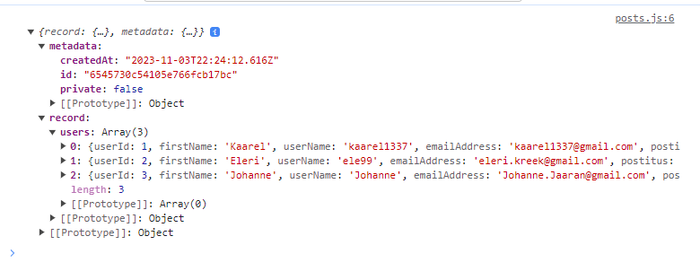

For outside source JSON file stored in JSONBin.io

That site meshes given JSON into it's own array and adds extra metadata array. In result the 'posts.js' file needs extra level of depth to access the needed arrays for homework.

